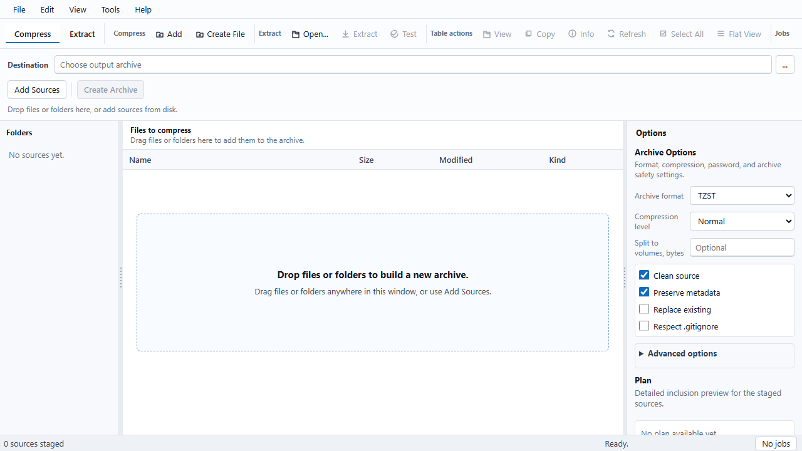

# ZManager Desktop

A fast, open-source Windows and Linux archive manager built on `zmanager-core`.

## Why this feels trustworthy

- Open-source, so archive behavior can be reviewed in code.
- Security-first handling stays in the Rust core (`zmanager-core`): path checks, overwrite policy, and normalization.
- Password input is handled in app state and is not logged.
- Every release includes checksums for verification.

## Get started in 60 seconds

1. Open [GitHub Releases](https://github.com/frankmanzhu/zmanager-desktop/releases/latest).
2. Download the latest installer for your OS:
   - **Windows:** `zmanager-desktop-<version>-windows-x64-installer.exe` or `...-windows-arm64-installer.exe`
   - **Linux:** `zmanager-desktop-<version>-linux-x64` or `...-linux-arm64` (`.deb` / `.rpm`)
3. Install and open the app.
4. Open an archive -> extract/create -> watch progress in the job list.

### Package quick lookup

| Platform | Recommended package | Alt package |
|---|---|---|
| Windows x64 | `zmanager-desktop-<version>-windows-x64-installer.exe` | `zmanager-desktop-<version>-windows-x64-portable.exe` |
| Windows ARM64 | `zmanager-desktop-<version>-windows-arm64-installer.exe` | `zmanager-desktop-<version>-windows-arm64-portable.exe` |
| Linux x64 | `zmanager-desktop-<version>-linux-x64.deb` or `.rpm` | - |
| Linux ARM64 | `zmanager-desktop-<version>-linux-arm64.deb` or `.rpm` | - |

## Formats and positioning

- ZIP, TZST, TZAP, 7Z
- 7-Zip is historically Windows-first.
- `TZAP` is the cross-platform format this project targets for resilient, secure, and fast workflows on Windows and Linux.

## For users who want to go deeper

- Release notes: [`ReadMe.txt`](./ReadMe.txt)
- Engine context: [`zmanager` README](https://github.com/frankmanzhu/zmanager/blob/main/README.md)
- TZAP context: [`TZAP` README](https://github.com/frankmanzhu/tzap/blob/main/README.md)

## Developer docs

- [Developer setup and build details](./docs/developer-setup.md)
- [Architecture overview](./docs/ARCHITECTURE.md)
- [Requirements](./docs/REQUIREMENTS.md)
- [Roadmap](./docs/ROADMAP.md)
