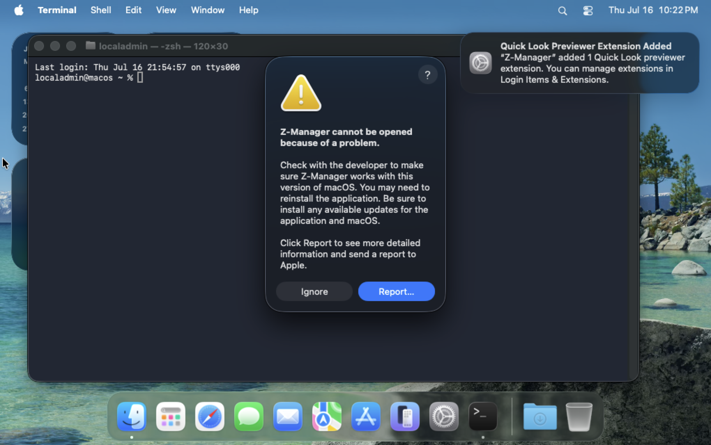

# macOS replacement Phase 0 installed-system evidence

- Evidence date: 2026-07-16 (Australia/Sydney)
- Result: **PASS with known baseline failures**
- Published source: [ZManager GUI v1.0.0](https://github.com/frankmanzhu/zmanager-gui/releases/tag/v1.0.0)
- Disposable system: Parallels Desktop Apple Virtualization VM `macOS`
- Guest: macOS 26.5.2 (`25F84`), arm64, console user `localadmin` (UID 501)
- Clean snapshot: `{37a9b547-fc89-4d8c-b4c1-4dc4fcfaef34}`
- Preserved post-upgrade snapshot:
  `{10bdef14-c713-4deb-8f31-60305536f3a1}`

No preference values, account contents, passwords, or other secret-bearing
state were emitted by this capture.

## Artifacts and identity

| Artifact | SHA-256 | Observed identity |
|---|---|---|
| Published `ZManager.zip` | `1f127c12b0285f18af05f205c14aeebb1bab4b88c15380b146f2e30d293e8198` | `ZManager.app`; `com.frankmanzhu.zmanager`; version `1.0.0`; build `1`; macOS 14.0; arm64 |
| Published `ZManager.dmg` | `931372c3b0efc42adaf5f65921216c0331bfd7ac23ed03230196afb2f78e3aa0` | Same published application |
| Current native reference ZIP | `d63eb7511e36d40ab59c935aee24c4b67b0469feb363c022dfe4e8325bf9675e` | `ZManager.app`; `com.frankmanzhu.zmanager`; version `1.0`; build `1`; arm64 |

The official GUI release contains no `x86_64` application artifact. Both
applications pass nested `codesign --verify --deep --strict` inspection. The
old application embeds Finder Sync and Quick Look preview extensions. The
current reference adds its Spotlight importer.

## Reproduction

The VM was restored to the clean snapshot, the published release and current
reference archives were copied into `/Users/Shared`, and these commands ran as
the guest console user through the capture helper:

```text
run-macos-phase0-vm-guest.sh baseline
run-macos-phase0-vm-guest.sh upgrade ZManager-current-native.zip
```

Both commands exited successfully. The harness treats an expected packaged-app
launch crash as captured evidence, not as a successful product launch. It also
registered and queried extensions, seeded only allowlisted non-secret preference
keys, and compared key names after replacement.

## Observations

| Check | Result |
|---|---|
| Published bundle identifier/version/build/architecture | PASS |
| Published nested signature verification | PASS |
| Finder Sync registration | PASS |
| Quick Look preview registration | PASS |
| Non-secret preference-key continuity after replacement | PASS |
| Current native nested signature verification | PASS |
| Published application cold launch | KNOWN FAILURE — missing Homebrew `liblzma.5.dylib` |
| Current native application launch | KNOWN FAILURE — missing Homebrew `liblzma.5.dylib` |
| Single canonical application after replacement | KNOWN FAILURE — two differently named app bundles remain |
| Post-upgrade canonical `open -b` resolution | KNOWN FAILURE — Launch Services selected the old bundle |

Both FFI libraries contain this unresolved clean-machine dependency:

```text
/opt/homebrew/opt/xz/lib/liblzma.5.dylib
```

The official application crash is incident
`5D31750A-F47D-4EB5-9B0C-938DF2AF858D`. The current native application crash is
incident `33A930CA-D0ED-4777-B5AF-76FA91E2DEB9`. A post-upgrade `open -b
com.frankmanzhu.zmanager` selected the old application and produced incident
`2164E56C-1F9C-41E8-A8E4-3C41051B759B`.




## Exit decision

Phase 0 passes because the starting revisions, published bytes, installed
identity, registration state, non-secret preference compatibility, and failed
launch/replacement behavior are now frozen and reproducible. The two observed
failures become explicit acceptance requirements for packaging and cutover:
the replacement must be self-contained and an upgrade must leave exactly one
canonical installed application.
